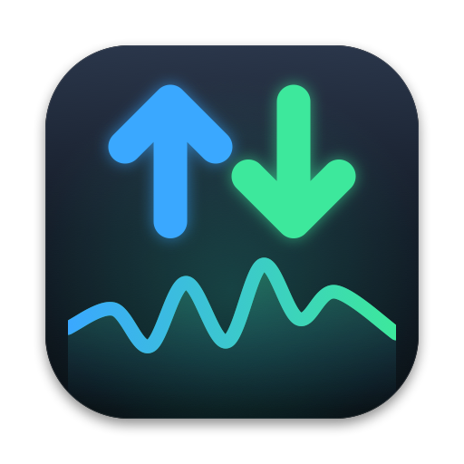
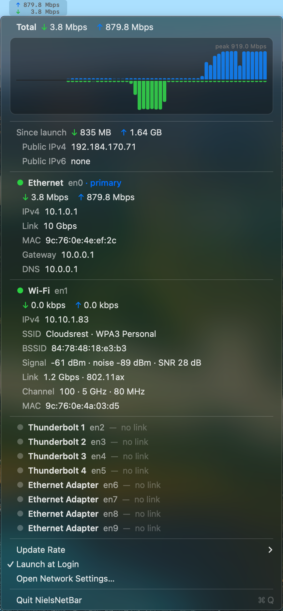

<p align="center">
  
</p>

<h1 align="center">NielsNetBar</h1>

<p align="center">
  A menu bar network monitor for macOS, in Swift. Live ↑/↓ throughput in the bar; every
  interface's state, addresses, link speed and Wi-Fi details in the dropdown.<br>
  No Dock icon, no window, no dependencies.
</p>

<p align="center">
  
</p>

```
./build.sh run            # debug build → dist/debug/NielsNetBar.app, launch it (add --hz 5, --fg)
./build.sh stop           # quit it
./build.sh install        # release build → /Applications/NielsNetBar.app, launch, add to Login Items
./build.sh uninstall      # remove the Login Item, the app, and its preferences
./build.sh status         # running? installed? login item?
./build.sh app            # release build → dist/NielsNetBar.app only
./build.sh dmg            # release build → dist/NielsNetBar-1.0.dmg, drag-to-Applications disk image
./build.sh icon           # re-render docs/icon.png
```

Re-running `install` replaces whatever is in `/Applications` with the current build.

To hand it to someone else, `./build.sh dmg` makes the usual disk image: the app, an
Applications folder to drag it onto, and a background that says what to expect — the
first launch from `/Applications` registers the Login Item (once; turning it off later
sticks) and asks for Location access for the SSID.

Without a Developer ID the build is ad-hoc signed and not notarized, so a copy that
arrives with a quarantine flag (browser download, AirDrop) is refused at first open and
has to be allowed in System Settings › Privacy & Security ("Open Anyway"); a copy that
comes over scp or a USB stick opens straight away. With one, put it in a git-ignored
`.signing` file next to `build.sh` and `app`/`dmg`/`install` sign with it (hardened
runtime, timestamped), notarize the app and the disk image, and staple both:

```
SIGN_IDENTITY="Developer ID Application: Niels Joubert (TEAMID)"
NOTARY_PROFILE=NielsNetBar   # from: xcrun notarytool store-credentials NielsNetBar --apple-id … --team-id … --password …
```

## What it shows

**In the bar** — two stacked lines, upload over download, summed across the physical
interfaces (`en*`; tunnels are left out because their packets are counted again on the port
that carries them). Bits per second, SI prefixes, fixed width so it never jiggles:

```
↑   1.3 Mbps
↓  65.6 kbps
```

Sampled at 2 Hz by default; **Update Rate** in the menu offers 1 / 2 / 5 Hz and remembers
the choice (`--hz N` overrides it for one run). The bar is only repainted when the digits
change, and not at all while the screen is locked or the displays are asleep (sampling
continues, so the chart and totals stay right); at 2 Hz it idles under 1 % CPU.

**In the dropdown** — first the total with a **chart of the last 60 seconds**: one bar per
second, blue ↑ growing up from the baseline and green ↓ growing down, on one linear scale set
by the window's peak (labelled). It records from launch, so it is full the first time you
open the menu, and keeps moving while the menu is open; hover a bar for that second's
numbers. Under it, bytes moved since launch and the **public IPv4/IPv6** (looked up via
[ipify](https://www.ipify.org) when the menu opens — never polled — and cached for a minute).

Then one block per interface, primary first, then connected → idle → down, in the order of
System Settings › Network:

| Dot | Meaning |
|---|---|
| 🟢 | link up and a routable address |
| 🟡 | link up but no address, or only a self-assigned `169.254.x.x` |
| ⚪ | down: no cable, Wi-Fi off / not associated. Shown as a single line. |

Each connected interface lists its live ↓/↑ rate, IPv4 and IPv6 addresses, negotiated
**link speed** (`10 Gbps` from the Ethernet media type; the current PHY rate for Wi-Fi),
MAC, and for Wi-Fi the **SSID** and security, **signal** (RSSI / noise / SNR), channel, band,
width and PHY mode. The primary interface also shows the **gateway** and **DNS** servers.
**Click any row to copy its value** (IP, SSID, MAC, …).

Below that: the update-rate submenu, a **Launch at Login** checkbox, a shortcut to Network
Settings, Quit.

Hardware ports come from System Configuration (the same list as System Settings, so a
Mac Studio shows its four Thunderbolt ports, grey until something is plugged in). VPN
tunnels (`utun*`, `ipsec*`, `ppp*`) appear only while they are up with an address.
Loopback, AirDrop's `awdl`/`llw`, bridges and the like are never shown.

## How it works

* `Sources/NielsNetBar/NetworkMonitor.swift` — byte counters from `sysctl(NET_RT_IFLIST2)`,
  one `if_msghdr2` per interface with 64-bit `ifi_ibytes`/`ifi_obytes`, the name from the
  `sockaddr_dl` that follows it in the same buffer. No subprocess, no parsing, ~40 µs per
  tick. Rates are deltas over a monotonic clock that keeps counting through sleep.
* `Interfaces.swift` — the dropdown's data. Names and types from `SCNetworkInterfaceCopyAll`,
  addresses and flags from `getifaddrs`, link state and Ethernet speed from
  `ioctl(SIOCGIFMEDIA)` (exactly what `ifconfig` reads for `status:` and `media:`), primary
  interface / router / DNS from the SCDynamicStore `State:/Network/Global/*` keys, and the
  ordering from `SCNetworkSetGetServiceOrder`.
* `WiFiInfo.swift` — CoreWLAN for RSSI, noise, channel, PHY rate, security. Plus the Location
  authorization that the SSID needs (below).
* `ChartView.swift` — the history chart, a custom `NSView` in an `NSMenuItem`. The monitor
  folds every sample into 1 s buckets (`NetworkMonitor.history`, a 60-entry ring buffer) so
  the chart looks the same at 1, 2 or 5 Hz; seconds lost to sleep are padded with zeros.
* `StatusBarController.swift` — the `NSStatusItem` and `NSMenu`. The bar text is drawn
  into an image rather than set as a title: that is what gets two lines centred in the bar.
  Blue ↑, green ↓, and grey digits — a mid-grey picked per appearance when the image is
  drawn, so it reads on a light or dark menu bar.
  The menu is rebuilt from a fresh snapshot each time it opens, and the rate rows keep
  updating while it is open (the timer runs in the `.common` run loop mode).
* `AppIcon.swift` — the icon, drawn in CoreGraphics: a blue ↑ and a green ↓ over a glowing
  throughput trace. `build.sh` renders it to an `.iconset` → `.icns` when it bundles the app.
* `LoginItem.swift` — `SMAppService.mainApp`. The app registers *itself*, so `build.sh
  install` launches the installed copy with `--enable-login-item`, and `uninstall` runs it
  with `--disable-login-item` before deleting it. A copy dragged in from the disk image
  registers on its first launch from `/Applications` instead; either way a
  `loginItemRegistered` default is set so it happens once and a later "off" is respected.
* `DMGBackground.swift` — the disk image's background picture, drawn in code like the icon
  (`build.sh dmg` renders it at 1× and 2× into one TIFF and lets Finder lay out the window).
* `main.swift` — flag parsing, the `NSApplicationDelegate`, and a few debug flags:
  `--print` (the menu's data as text), `--dump-bar PATH` (the bar image), `--dump-chart PATH`
  (the chart with fake data).

## Gotchas

* **The SSID needs Location access.** Since macOS 14, CoreWLAN returns `nil` for the network
  name unless the app has Location authorization — and as of 15.7 the old workarounds
  (`ipconfig getsummary`, `system_profiler`) are redacted too. The installed app asks once at
  first launch; a dev build (`build.sh run`) does not ask by itself, because every ad-hoc
  rebuild is a "new app" to macOS and would re-prompt — its SSID row says so and asks on
  click. Everything else about Wi-Fi shows without the permission.
* **Ad-hoc signed.** No developer certificate: the bundle is signed with `-`, which is enough
  for Login Items and the Location prompt to work, but each rebuild gets a new
  identity, so permissions granted to a dev build don't survive the next `run`. The installed
  copy keeps them until you `install` again.
* **10 GbE overflows the kernel's baud-rate field** — `ifi_baudrate` is 32-bit in practice and
  reads `4294967295` on a 10 Gbps port. That is why link speed comes from the media type
  instead.
* **Launch at Login and dev builds.** The checkbox registers whichever bundle is running. From
  `build.sh run` that is `dist/debug/NielsNetBar.app` — fine for a test, but use `install` for
  the real thing.

## Requirements

macOS 15+, Xcode 16+ / Swift 5.10+ toolchain (Command Line Tools are enough — pure SwiftPM,
no Xcode project). Apple Silicon or Intel.

## License

NielsNetBar is free software under the [GNU General Public License, version 3 or
later](LICENSE). Use it, change it, ship it, sell it — but anything built from it has to
be released under the same terms, with source.
